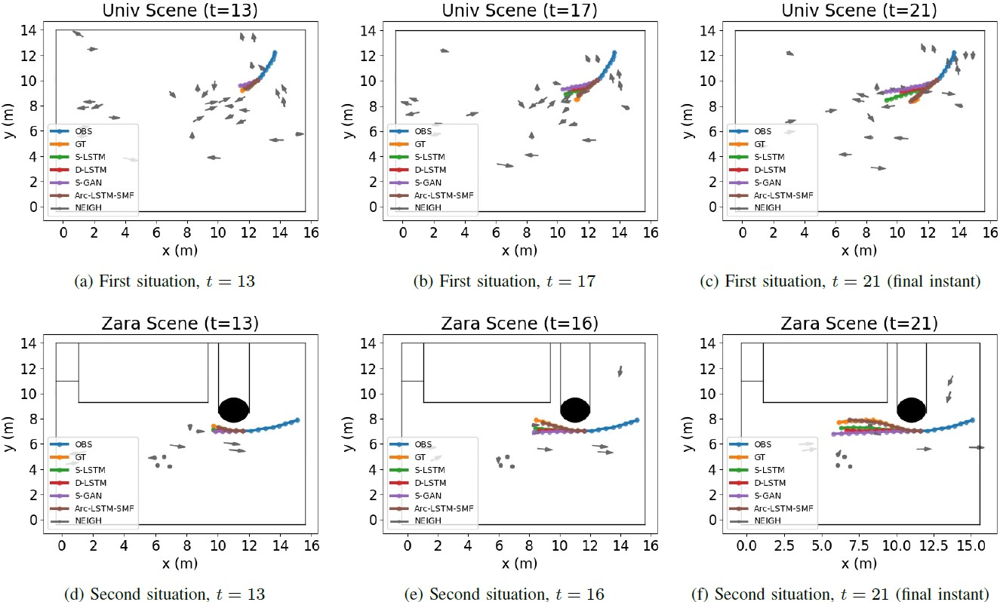

# Arc-LSTM-SMF: Scene and interaction-aware model for trajectory forecast

This repository contains the code for the training and evaluation of the
Arc-LSTM-SMF model, as well as its standalone counterparts (Arc-LSTM, LSTM-SMF, LSTM).

The model was built in the context of the master thesis
"Pedestrian Trajectory Prediction with Deep Learning" (not publicly available yet).

## Model

The Arc-LSTM-SMF model is based on Long Short Term Memory, and takes into account obstacles and
neighbouring humans to robustly predict pedestrian trajectories.

The presence of obstacles is incorporated by integrating the model with Sparse Motion Fields,
that learn regions absent of pedestrian motion in an unsupervised way.

The existence of interactions is incorporated with a pooling layer that simulates a
field of view for each pedestrian.


## Getting started

The code was developed in Windows 10, using [Python 3.7/3.8/3.9](https://www.python.org/downloads/),
the [Pytorch](https://pytorch.org) framework, and [Anaconda](https://www.anaconda.com) for managing packages.
However, it was made compatible to also run in Unix-like systems. 

If you have any problems running the code or installing dependencies,
please post an Issue describing the problem and your specification (operating system, python version. etc.).

You can setup by creating a new conda environment, and installing the required dependencies
(note: A lightweight list of the requirements is available if you do not wish do visualize trajectories,
so replace requirements.txt with requirements_lightweight.txt if you prefer).
After cloning the repository, run the following lines in a terminal:
```
conda create --name arclstmsmf python=3.8 -y
conda activate arclstmsmf
conda develop .
pip install -r requirements.txt
```

On Windows, to install Pytorch with GPU support, the command may differ. See [here](https://pytorch.org)

If conda develop fails (or if you do not use Anaconda),
then you must manually add the `models` directory path to 
[site packages](https://stackoverflow.com/questions/7901373/configuring-python-to-use-additional-locations-for-site-packages). 


## Download trained models

The models used to replicate experiments can be downloaded in a zip file,
using [this link](https://drive.google.com/file/d/160_IaOBrzewLDdae1FdQRjrYoy4SCwUb/view?usp=sharing) (~140 MB).

The State-of-the-art models are not directly available,
because they belong to [another repository](https://github.com/pedro-mgb/trajnetplusplusbaselines).
Nonetheless, Their predictions on the test set were saved.
You can get them in a zip file, from [this link](https://drive.google.com/file/d/12hbkKnhk2tZ8uZkc_LwQQhQUXQpNGPSZ/view?usp=sharing)
(~150 MB compressed, ~2 GB uncompressed).

You should unzip the files in the `saved_models/` folder.

On an system like Ubuntu, you can run the following shell scripts, to download and unzip the models and
the pre-computed predictions of other models:
```
cd saved_models
gdown --id 160_IaOBrzewLDdae1FdQRjrYoy4SCwUb
unzip our_models.zip
rm our_models.zip
gdown --id 12hbkKnhk2tZ8uZkc_LwQQhQUXQpNGPSZ
unzip other_models_pre_computed_predictions.zip
rm other_models_pre_computed_predictions.zip
cd ..
```

## Quantitative evaluation

An evaluation script is available [here](models/evaluate.py).
You can evaluate LSTM-based models (such as Arc-LSTM-SMF), as well as simpler baselines.

Make sure you run all scripts from the parent directory (the directory where this README lies).

Example of geometric-only evaluation (ADE/FDE), for constant velocity method; run this line in a terminal:
```
python models/evaluate.py --cv --test_dir datasets_in_trajnetpp21/test --test_files_individually
```

To evaluate our Arc-LSTM-SMF model in the same conditions, run this line in a terminal:
(may take a few minutes to run, especially on univ scene;
this assumes you have downloaded the models as shown in the previous sections)
```
python models/evaluate.py --model_path saved_models/arc_lstm_smf_21 --test_dir datasets_in_trajnetpp21/test --test_files_individually --environment_location datasets_utils/environment --social_metrics --static_collisions_neighbours
```

The above line is for [Trajnet++ data with trajectory length equal to 21](datasets_in_trajnetpp21).
For data with length 11, you must supply `--obs_len 5 --pred_len 6`, as shown below: 
```
python models/evaluate.py --model_path saved_models/arc_lstm_smf_11 --test_dir datasets_in_trajnetpp11/test --test_files_individually --obs_len 5 --pred_len 6 --environment_location datasets_utils/environment --social_metrics --static_collisions_neighbours
```

You can also evaluate other state-of-the-art methods.
If you also downloaded the pre-computed predictions of other models,
you can run this line to obtain results for Social-LSTM:
```
python models/evaluate.py --model_pred_path saved_models/other_models_21/lstm_social_None_modes1 --test_dir datasets_in_trajnetpp21/test --test_files_individually --environment_location datasets_utils/environment --social_metrics --static_collisions_neighbours
```

## Training models 

See [TRAINING.md](TRAINING.md).

## Visualization of trajectories

See [VISUALIZING.md](VISUALIZING.md).

## Obtained Results

__Quantitative results__:

| Metrics            | CV          | [SMF](https://www.researchgate.net/publication/344793892_Sparse_motion_fields_for_trajectory_prediction) | [S-LSTM](https://ieeexplore.ieee.org/document/7780479?reload=true) | [D-LSTM](https://arxiv.org/abs/2007.03639) | [S-GAN](https://arxiv.org/abs/1803.10892) | Arc-LSTM-SMF (__ours__) |
|--------------------|-------------|-------------|-------------|-------------|-------------|--------------|
| ADE / FDE (m)      | 0.63 / 1.38 | 1.17 / 2.14 | <u>__0.62__</u> / 1.33 | 0.66 / 1.44 | 0.67 / 1.36 | <u>__0.62__</u> / <u>__1.32__</u>  |
| CSE / OSB (%)      | 1.5 / 14.5  | <u>__0.4__</u> / <u>__0__</u>     | 1.1 / 10.9  | 1.1 / 12.9  | 0.9 / 6.0   | <u>__0.4__</u> / 12.2   |
| Col-P / Col-GT (%) | 11.1 / 11.6 | 10.8 / 14.5 | 10.3 / <u>__10.0__</u> | 7.7 / 11.4  | 12.7 / 11.3 | <u>__7.3__</u> / 10.1   |


__Examples of model predictions__:
With Arc-LSTM-SMF (our model) in brown. GT in orange. Past in blue.
Obtained with [the visualization scripts from this repo](VISUALIZING.md)




